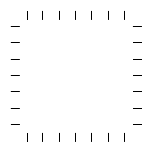
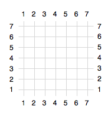
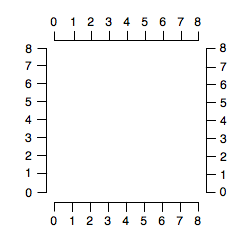
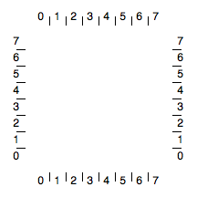
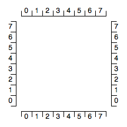

Each example shows axes in four orientations. In clockwise order: top, right, bottom, left. Most commonly an *x* scale would be drawn with the bottom orientation, and a *y* scale would be drawn with the left orientation. For a [scatterplot matrix](http://vis.stanford.edu/protovis/ex/flowers.html), you might want to alternate orientations for the edge cells.

* grid - major, minor, none
* domain - open, closed (true/false?)
* tick - tick, none (true/false?)
* labels - point, section

## Open Domain

An **open domain** means that only ticks or grid lines are drawn:

It is also possible to draw both ticks and grid lines. If the ticks are not drawn, then the labels are positioned closer to the grid lines.

## Closed Domain

A **closed domain** means that we can visualize the domain extent. This can be done in by drawing a path:

Or by filling the background. In this case we include major and minor grid lines which subdivide the ticks:

Note that the grid lines can also be drawn with an open domain, as above. And the background need not be filled—we could instead stroke the background to create a frame.

## Sectional

Sometimes we want to label sections rather than points on the axes:

