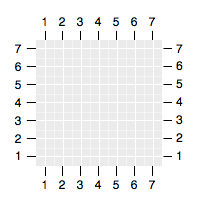

Each example shows axes in four orientations. In clockwise order: top, right, bottom, left. Most commonly an *x* scale would be drawn with the bottom orientation, and a *y* scale would be drawn with the left orientation. For a [scatterplot matrix](http://vis.stanford.edu/protovis/ex/flowers.html), you might want to alternate orientations for the edge cells.

## Examples

### Open Domain

An **open domain** means that only ticks or grid lines are drawn:

It is also possible to draw both ticks and grid lines. If the ticks are not drawn, then the labels are positioned closer to the grid lines.

### Closed Domain

A **closed domain** means that we can visualize the domain extent. This can be done in by drawing a path that replaces the first and last tick:

Note that the start and end of the path may or may not be coincident with the first and last tick. If the scale domain is nice'd, then it should always be coincident; if the scale domain is not niced, then the start and end of the path ticks probably should not have labels (as they could be arbitrary-precision values that overlap with the ticks). Or, maybe there's a setting to display the min and max of the domain even if they aren't nice values.

You can also visualize the domain by filling or stroking a frame. In this case we include major and minor grid lines which subdivide the ticks:

Note that the grid lines can also be drawn with an open domain, as above. And the background need not be filled—we could instead stroke the background to create a frame. The grid lines should have a "major" or "minor" class as appropriate for styling.

### Sectional

Sometimes we want to label sections rather than points on the axes:

## Layering

It might not be possible to implement the axis as a single component; this is because the z-ordering of the axes' visual elements may exist on different layers relative to the other chart graphics. Most commonly, the grid lines may need to be drawn over or under the chart graphics (e.g., line or area) depending on user preference. The ggplot2-style grid lines would be drawn under the elements, while the Tufte-style grid lines would be drawn over the elements.

One way to solve this might be to break out the grid as a separate component. This way, the ticks and labels (and potentially a stroked frame, as in the qq-plot) could be drawn _over_ the chart graphics. Then, a grid component could be used to draw reference lines _under_ the graphics.

## Settings

* scale - the associated [[scale|Scales]], either ordinal or quantitative
* tickCount - the number of ticks to generate
* tickFormat - the function to format labels. if null, hide labels?
* tickGrid - major, minor, none
* orient - top, right, bottom, left
* domain - open, closed
