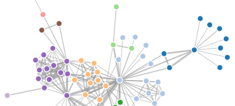

> [[API Reference]] ▸ [[Layouts]]

A flexible force-directed graph layout implementation using position [Verlet integration](http://en.wikipedia.org/wiki/Verlet_integration) to allow [simple constraints](http://www.csse.monash.edu.au/~tdwyer/Dwyer2009FastConstraints.pdf). For more on physical simulations, see [Thomas Jakobsen](http://www.gamasutra.com/resource_guide/20030121/jacobson_pfv.htm). This implementation uses a quadtree to accelerate charge interaction using the [Barnes–Hut approximation](http://en.wikipedia.org/wiki/Barnes%E2%80%93Hut_simulation). In addition to the repulsive [charge](#charge) force, a psuedo-[gravity](#gravity) force keeps nodes centered in the visible area. Links are fixed-[distance](#distance) geometric constraints.

Additional custom forces and constraints may be applied on the "tick" event, simply by updating the *x* and *y* attributes of nodes. For example, this can be used to implement [multiple](http://bl.ocks.org/1021953) [foci](http://bl.ocks.org/1021841). The layout algorithm is also extremely robust in dealing with [disconnected graphs](http://bl.ocks.org/929623).

<a name="force" href="#force">#</a> d3.layout.<b>force</b>()

Constructs a new, default force-directed layout.

<a name="size" href="#size">#</a> force.<b>size</b>([<i>size</i>])

Get or set the layout size in *x* and *y*.

<a name="distance" href="#distance">#</a> force.<b>distance</b>([<i>distance</i>])

Get or set the link distance.

<a name="friction" href="#friction">#</a> force.<b>friction</b>([<i>friction</i>])

Get or set the friction coefficient in [0,1].

<a name="charge" href="#charge">#</a> force.<b>charge</b>([<i>charge</i>])

Get or set the charge strength. A negative number is recommended for repulsion.

<a name="gravity" href="#gravity">#</a> force.<b>gravity</b>([<i>gravity</i>])

Get or set the gravity strength.

<a name="theta" href="#theta">#</a> force.<b>theta</b>([<i>theta</i>])

Get or set the accuracy of the charge interaction (Barnes–Hut approximation).

<a name="nodes" href="#nodes">#</a> force.<b>nodes</b>([<i>nodes</i>])

Get or set the array of nodes to layout.

<a name="links" href="#links">#</a> force.<b>links</b>([<i>links</i>])

Get or set the array of links between nodes.

<a name="start" href="#start">#</a> force.<b>start</b>()

Start the simulation. Can also be used to restart the simulation when the nodes or links change. As the layout stabilizes, it cools, slowing down movement and eventually stopping. This way, it doesn't hog the CPU or drain the battery.

<a name="resume" href="#resume">#</a> force.<b>resume</b>()

Reheat the cooling parameter (*alpha*) and restart simulation.

<a name="stop" href="#stop">#</a> force.<b>stop</b>()

Immediately terminate the simulation.

<a name="on" href="#on">#</a> force.<b>on</b>(<i>type</i>, <i>listener</i>)

Listen to "tick" updates in the computed layout positions. Use this to update the displayed nodes and links.

<a name="drag" href="#drag">#</a> force.<b>drag</b>()

Bind a behavior to nodes to allow interactive dragging. Use in conjunction with the [call](Selections#call) operator on the nodes.