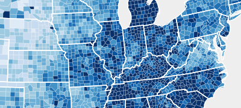

> [[API Reference]] ▸ [[Geo]]

For cartographic visualizations, D3 supports a handful of utilities for displaying and manipulating **geographic data**. These utilities are based on the [GeoJSON format](http://geojson.org/geojson-spec.html)—a standard way of representing geographic features in JavaScript. For example, [GDAL](http://www.gdal.org/) includes the ogr2ogr tool which can convert binary shapefiles into GeoJSON; the shapefile is another common representation for geographic data, frequently used by the [U.S. Census Bureau](http://www.census.gov/).



Some other tools you may be interested in:

* [Shapely](http://trac.gispython.org/lab/wiki/Shapely) - manipulation of planar geometry objects.
* [MapShaper](http://mapshaper.org/) and [Bloch](https://github.com/migurski/Bloch/) - shapefile simplification.
* [ColorBrewer](http://colorbrewer2.org) - color scales for maps.
* [PostGIS](http://postgis.refractions.net/) - a geospatial database.

The primary mechanism for displaying geographic data is [d3.geo.path](#path). In many ways, this class is similar to [d3.svg.line](SVG-Shapes#line): given a geometry or feature object, it generates the path data string suitable for the "d" attribute of an SVG path element.

<a name="path" href="#path">#</a> d3.geo.<b>path</b>()

Creates a new geographic path generator with the default settings: the [albersUsa](Geo-Projections#albersUsa) projection and a point radius of 4.5 pixels.

<a name="_path" href="#_path">#</a> <b>path</b>(<i>feature</i>[, <i>index</i>])

Returns the path data string for the given *feature*. For example, to display multiple features:

```javascript
vis.selectAll("path")
    .data(features)
  .enter().append("svg:path")
    .attr("d", d3.geo.path());
```

Note: you probably want to specify the style property "fill-rule" as "evenodd". Without this, geographic features with holes (such as [South Africa](http://en.wikipedia.org/wiki/South_Africa) surrounding [Lesotho](http://en.wikipedia.org/wiki/Lesotho)) will not display correctly.

<a name="path_projection" href="#path_projection">#</a> path.<b>projection</b>([<i>projection</i>])

<a name="path_area" href="#path_area">#</a> path.<b>area</b>(<i>feature</i>)

<a name="path_centroid" href="#path_area">#</a> path.<b>centroid</b>(<i>feature</i>)

<a name="path_pointRadius" href="#path_pointRadius">#</a> path.<b>pointRadius</b>([<i>radius</i>])

<a name="bounds" href="#bounds">#</a> d3.geo.<b>bounds</b>(<i>feature</i>)
