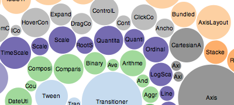

> [[API Reference]] ▸ [[Layouts]]

[](http://mbostock.github.com/d3/ex/pack.html)

[](http://mbostock.github.com/d3/ex/bubble.html)

Like most other layouts, the object returned by d3.layout.pack is both an object and a function. That is: you can call the layout like any other function, and the layout has additional methods that change its behavior. Like other classes in D3, layouts follow the method chaining pattern where setter methods return the layout itself, allowing multiple setters to be invoked in a concise statement.

<a name="pack" href="#pack">#</a> d3.layout.<b>pack</b>()

Creates a new pack layout with the default settings: the default sort order is by ascending value; the default children accessor assumes each input node is an object with a children array; the default size is 1×1.

The pack layout is part of D3's family of [[hierarchical|Hierarchical-Layout]] layouts. These layouts follow the same basic structure: the input argument to the layout is the root node of the hierarchy, and the output return value is an array representing the computed positions of all nodes, along with several other attributes:

* parent - the parent node, or null for the root.
* children - the array of child nodes, or null for leaf nodes.
* value - the node value, as returned by the value accessor.
* depth - the depth of the node, starting at 0 for the root.
* x - the computed *x*-coordinate of the node position.
* y - the computed *y*-coordinate of the node position.
* data - the underlying data represented by this node.

Note that these position objects are not the same as the input data passed to the layout function; the computed layout nodes wrap the data objects.

<a name="sort" href="#sort">#</a> pack.<b>sort</b>([<i>comparator</i>])

If *comparator* is specified, sets the sort order of sibling nodes for the layout using the specified comparator function.  If *comparator* is not specified, returns the current group sort order, which defaults to ascending order by the associated input data's numeric value attribute:

```javascript
function comparator(a, b) {
  return a.value - b.value;
}
```

The comparator function is invoked for pairs of nodes, being passed the input data for each node. A null comparator disables sorting and uses tree traversal order. Comparator functions may also be implemented using [d3.ascending](Arrays#d3_ascending) or [d3.descending](Arrays#d3_descending).

<a name="children" href="#children">#</a> pack.<b>children</b>([<i>children</i>])

<a name="links" href="#links">#</a> pack.<b>links</b>(<i>nodes</i>)

<a name="value" href="#value">#</a> pack.<b>value</b>([<i>value</i>])

<a name="size" href="#size">#</a> pack.<b>size</b>([<i>size</i>])
