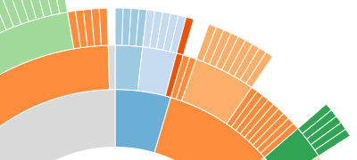

> [Wiki](Home) ▸ [[API Reference]] ▸ [[Layouts]] ▸ [Hierarchy](Hierarchy-Layout) ▸ **Partition Layout**

The **partition layout** produces adjacency diagrams: a space-filling variant of a node-link tree diagram. Rather than drawing a link between parent and child in the hierarchy, nodes are drawn as solid areas (either arcs or rectangles), and their placement relative to other nodes reveals their position in the hierarchy. The size of the nodes encodes a quantitative dimension that would be difficult to show in a node-link diagram.



Like other classes in D3, layouts follow the method chaining pattern where setter methods return the layout itself, allowing multiple setters to be invoked in a concise statement.

<a name="partition" href="Partition-Layout#wiki-partition">#</a> d3.layout.<b>partition</b>()

Creates a new partition layout with the default settings: the default sort order is by descending value; the default value accessor assumes each input data is an object with a numeric value attribute; the default children accessor assumes each input data is an object with a children array; the default size is 1×1.

<a name="sort" href="Partition-Layout#wiki-sort">#</a> partition.<b>sort</b>([<i>comparator</i>])

If *comparator* is specified, sets the sort order of sibling nodes for the layout using the specified comparator function.  If *comparator* is not specified, returns the current group sort order, which defaults to descending order by the associated input data's numeric value attribute:

```javascript
function comparator(a, b) {
  return b.value - a.value;
}
```

The comparator function is invoked for pairs of nodes, being passed the input data for each node. A null comparator disables sorting and uses tree traversal order. Comparator functions may also be implemented using [d3.ascending](Arrays#wiki-d3_ascending) or [d3.descending](Arrays#wiki-d3_descending).

<a name="children" href="Partition-Layout#wiki-children">#</a> partition.<b>children</b>([<i>children</i>])

If *children* is specified, sets the specified children accessor function. If *children* is not specified, returns the current children accessor function, which by default assumes that the input data is an object with a children array:

```javascript
function children(d) {
  return d.children;
}
```

Often, it is convenient to load the node hierarchy using [d3.json](Requests#wiki-d3_json), and represent the input hierarchy as a nested [JSON](http://json.org) object. For example:

```javascript
{
 "name": "flare",
 "children": [
  {
   "name": "analytics",
   "children": [
    {
     "name": "cluster",
     "children": [
      {"name": "AgglomerativeCluster", "size": 3938},
      {"name": "CommunityStructure", "size": 3812},
      {"name": "MergeEdge", "size": 743}
     ]
    },
    {
     "name": "graph",
     "children": [
      {"name": "BetweennessCentrality", "size": 3534},
      {"name": "LinkDistance", "size": 5731}
     ]
    }
   ]
  }
 ]
}
```

The children accessor is first invoked for root node in the hierarchy. If the accessor returns null, then the node is assumed to be a leaf node at the layout traversal terminates. Otherwise, the accessor should return an array of data elements representing the child nodes.

<a name="nodes" href="Partition-Layout#wiki-nodes">#</a> partition.<b>nodes</b>(<i>root</i>)

Runs the partition layout, returning the array of nodes associated with the specified *root* node. The partition layout is part of D3's family of [[hierarchical layouts|Hierarchy-Layout]]. These layouts follow the same basic structure: the input argument to the layout is the root node of the hierarchy, and the output return value is an array representing the computed positions of all nodes. Several attributes are populated on each node:

* parent - the parent node, or null for the root.
* children - the array of child nodes, or null for leaf nodes.
* value - the node value, as returned by the value accessor.
* depth - the depth of the node, starting at 0 for the root.
* x - the minimum *x*-coordinate of the node position.
* y - the minimum *y*-coordinate of the node position.
* dx - the *x*-extent of the node position.
* dy - the *y*-extent of the node position.

Although the layout has a size in *x* and *y*, this represents an arbitrary coordinate system; for example, you can treat *x* as a radius and *y* as an angle to produce a radial rather than Cartesian layout. In Cartesian orientation, *x*, *y*, *dx* and *dy* correspond to the "x", "y", "width" and "height" attributes of the SVG [[rect|SVG-Shapes#wiki-svg_rect]] element. In radial orientation, they can be used to compute the innerRadius, startAngle, outerRadius and endAngle of an [[arc|SVG-Shapes#wiki-arc]] generator. The Cartesian orientation may be called an **icicle tree**, while the radial orientation is called a **sunburst**.

<a name="links" href="Partition-Layout#wiki-links">#</a> partition.<b>links</b>(<i>nodes</i>)

Given the specified array of *nodes*, such as those returned [nodes](Partition-Layout#wiki-nodes), returns an array of objects representing the links from parent to child for each node. Leaf nodes will not have any links. Each link is an object with two attributes:

* source - the parent node (as described above).
* target - the child node.

This method is useful for retrieving a set of link descriptions suitable for display, often in conjunction with the [diagonal](SVG-Shapes#wiki-diagonal) shape generator. For example:

```javascript
svg.selectAll("path")
    .data(partition.links(nodes))
  .enter().append("path")
    .attr("d", d3.svg.diagonal());
```

<a name="value" href="Partition-Layout#wiki-value">#</a> partition.<b>value</b>([<i>value</i>])

If *value* is specified, sets the value accessor to the specified function. If *value* is not specified, returns the current value accessor, which assumes that the input data is an object with a numeric value attribute:

```javascript
function value(d) {
  return d.value;
}
```

The value accessor is invoked for each input data element, and must return a number representing the numeric value of the node. This value is used to set the area of each node proportionally to the value.

<a name="size" href="Partition-Layout#wiki-size">#</a> partition.<b>size</b>([<i>size</i>])

If *size* is specified, sets the available layout size to the specified two-element array of numbers representing *x* and *y*. If *size* is not specified, returns the current size, which defaults to 1×1.